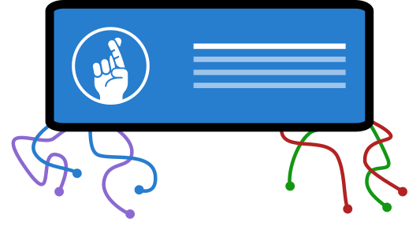
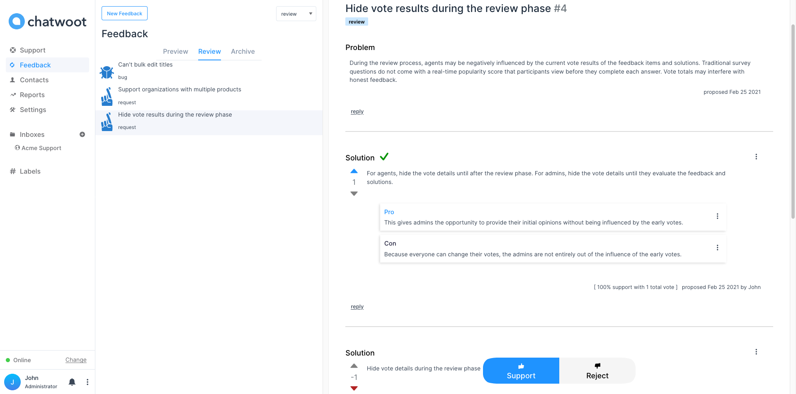

  

  
Chat support plus feedback management.

  
An <u>unofficial</u> extension to 
    <a href="https://github.com/chatwoot/chatwoot">chatwoot</a>.
  

---

## Features

all of chatwoot's [features](https://github.com/chatwoot/chatwoot#features) plus:

- *Collecting feedback*
  - At the moment, collecting feedback from your customers is accomplished by the existing channels provided by chatwoot. 
    - At some point down the road, I plan on adding modifications to some of these channels to enhance feedback collection. 
- *Managing feedback*
  - Track
    - Create feedback items for suggestions you wish to track
  - Debate
    - When creating feedback items you frame the feedback as a problem with potential solutions.
    - Agents can propose alternative solutions and provide pros and cons for each solution  
  - Evaluate
    - Agents can vote on feedback items and their solutions. 
    - After review by the entire team, admins can select the best solution(s) to be implemented to solve the problem. Admins can optionally add any final thoughts on the "judgment tab."

---

## Why build on top of chatwoot

There are many reasons why I chose to build on top of chatwoot, below are the top five.

1. I’m a big-time fan of chatwoot’s <a href=”https://github.com/chatwoot/chatwoot”>core software</a> and a small-time contributor. 

2. The core team is extremely helpful. They continue to answer all my questions as I contribute to their core software and build this extension. The support they provide to their open source community is unbelievable.

3. Chatwoot is built with my favorite tech stack. 

4. Building on the shoulders on chatwoot allows the users on this extension to have a solution that attacks both customer support and feedback.

5. No need to start from scratch. I can focus on just building the feedback component. I don’t have to worry about so many other things that chatwoot already solves, like deployment. 

---

## Documentation

Documentation is wip.

Chatwoot's documentation is available at [www.chatwoot.com/help-center](https://www.chatwoot.com/help-center).

---

## Branching model

The base branch is `develop`. If you are looking for a stable version, please use the `master` or tags labelled as `v1.x.x`. 

Chatwoot's base branch is `cw-develop` and master branch is `cw-master`.

---

## Deployment

Please refer to [chatwoot](https://github.com/chatwoot/chatwoot#deployment). This extension does not require any changes. 

---

## Chatwoot web vs Chatwoot mobile

Currently, this extension only extends [chatwoot web](https://github.com/chatwoot/chatwoot) and not [chatwoot mobile](https://github.com/chatwoot/chatwoot-mobile-app). However, the goal is for the extension not to break chatwoot mobile. 

But, I have not got around to testing the mobile version yet. Please report any issues as they come up. 

---

### Contributing

PR and issues should be focused on this extension only. Beyond the scope of this extension, I will not make any changes to chatwoot.

If you are unsure about the line between chatwoot and this extension, just post all your issues here instead of at chatwoot’s repo. I will direct you to chatwoot if your issue falls outside of the extension’s scope. 

*Chatwoot* &copy; 2017-2021, Chatwoot Inc - Released under the MIT License.
